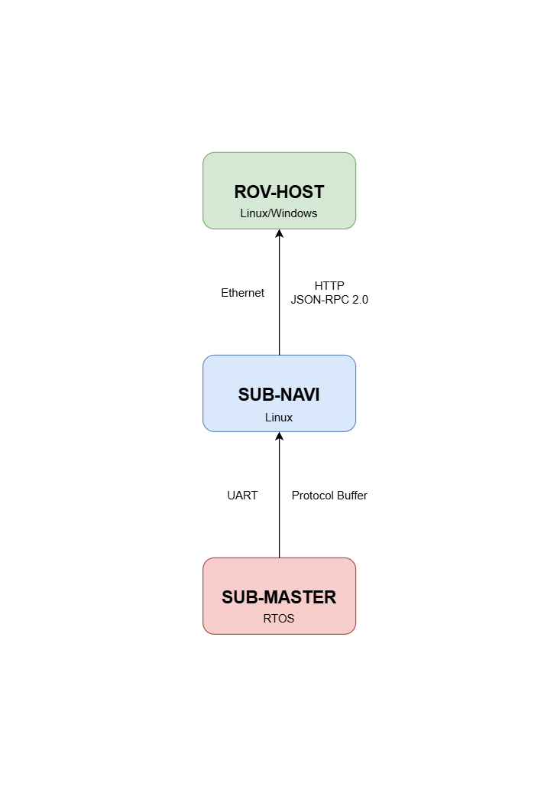

<div align="center">
  <a href="https://github.com/JMU-Underwater/sub-navi"></a>
  <a href="https://github.com/JMU-Underwater/sub-navi"><h1>SUB-NAVI</h1></a>
</div>

[](https://deepwiki.com/JMU-Underwater/sub-navi)   

[ 中文 | [English](README_EN.md) ]

## 项目介绍

本项目（SUB-NAVI）是基于 Linux 平台的通用型水下机器人控制程序，本项目需要搭配 [ESP-SUB-MASTER](https://github.com/sfxfs/esp-sub-master) 和 [ROV-HOST](https://github.com/bohonghuang/rov-host) 使用，本软件测试基于硬件平台 [Underwater-Vehicle-Electrical-Control-System](https://github.com/SFerret/Underwater-Vehicle-Electrical-Control-System)。

系统架构连接图如下：



SUB-NAVI 可以实现以下功能：

- 与 PC 端上位机 (ROV-HOST) 基于 HTTP 协议的 JSON-RPC 2.0 通信（采用 IO 事件监听提高性能）
- 与 SUB-MASTER 基于 Protocol Buffer 的串口通信（用于控制底层外设，推进器，机械臂，等）
- 通过串口外接传感器和其他外设
- 基于文件系统的配置管理（CSV、JSON）
- 运动控制算法

## 程序编译

本项目测试搭载于 `Rockchip rv1103`，架构为 `armhf`，请搭配 `arm-rockchip830-linux-uclibcgnueabihf` 编译器使用，若使用其他芯片，请自行下载好对应平台的交叉编译器（工具链）。

编译推荐在 Linux 环境下，测试使用 `Ubuntu 22.04`，并确保已安装好：

- 对应平台的交叉编译器（并添加至 PATH）
- `cmake`

进入项目根目录并输入命令进行编译：

```shell
cmake -B build -DCMAKE_BUILD_TYPE=Release -DCMAKE_C_COMPILER=arm-rockchip830-linux-uclibcgnueabihf-gcc -DCMAKE_CXX_COMPILER=arm-rockchip830-linux-uclibcgnueabihf-g++ && cmake --build build --config Release
```

如果使用 VSCode 进行开发和编译，还需安装：

- `CMake Tools` VSCode 插件
- `ninja-build` 系统软件包

使用 VSCode 打开项目文件夹后，在弹出的选框中选择对应工具链，再在底栏选择生成即可编译。

## 软件开发

项目主要有三个根目录的文件夹

| 名称          | 用途                 |
| ------------- | -------------------- |
| 3rd           | 第三方库和通用的代码 |
| config-header | 全局配置和类型头文件 |
| user          | 用户项目代码         |

`user` 文件夹下主要有几个功能模块

| 名称                | 用途                   |
| ------------------- | ---------------------- |
| control             | 机器人姿态控制算法     |
| csv-json-config-sys | 配置管理系统           |
| peripheral          | 外设驱动相关代码       |
| protobuf-commu      | 与 SUB-MASTER 通信代码 |