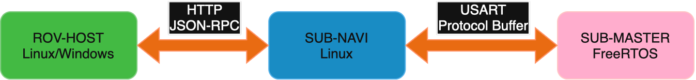

<div align="center">
    <a href="https://github.com/JMU-Underwater/sub-navi"></a>
    <a href="https://github.com/JMU-Underwater/sub-navi"><h1>SUB-NAVI</h1></a>
  </div>

  [](https://deepwiki.com/JMU-Underwater/sub-navi)   

  [ English | [中文](README.md) ]

  ## Project Introduction

  This project (SUB-NAVI) is a general-purpose underwater robot control program based on the Linux platform. It requires integration with [ESP-SUB-MASTER](https://github.com/JMU-Underwater/esp-sub-master) and [ROV-HOST](https://github.com/JMU-Underwater/rov-host) for use. The software has been tested on the hardware platform [Underwater-Vehicle-Electrical-Control-System](https://github.com/JMU-Underwater/Underwater-Vehicle-Electrical-Control-System).

  The system architecture connection diagram is as follows:

  

  SUB-NAVI can achieve the following functionalities:

  - Communication with the PC-side host (ROV-HOST) based on the HTTP protocol using JSON-RPC 2.0 (utilizing IO event monitoring for improved performance)
  - Serial communication with SUB-MASTER based on Protocol Buffer (for controlling underlying peripherals, thrusters, robotic arms, etc.)
  - Connection to external sensors and other peripherals via serial ports
  - Configuration management based on the file system (CSV, JSON)
  - Motion control algorithms

  ## Program Compilation

  This project is tested on the `Rockchip rv1103` with the `armhf` architecture. Please use the `arm-rockchip830-linux-uclibcgnueabihf` compiler. If using other chips, download the corresponding cross-compiler (toolchain) for the target platform.

  Compilation is recommended in a Linux environment (tested on `Ubuntu 22.04`). Ensure the following are installed:

  - Cross-compiler for the target platform (added to PATH)
  - `cmake`

  Navigate to the project root directory and enter the following command to compile:

  ```shell
  cmake -B build -DCMAKE_BUILD_TYPE=Release -DCMAKE_C_COMPILER=arm-rockchip830-linux-uclibcgnueabihf-gcc -DCMAKE_CXX_COMPILER=arm-rockchip830-linux-uclibcgnueabihf-g++ && cmake --build build --config Release
  ```

  If using VSCode for development and compilation, also install:

  - The `CMake Tools` VSCode extension
  - The `ninja-build` system package

  After opening the project folder in VSCode, select the corresponding toolchain from the pop-up menu, then choose the build option in the bottom bar to compile.

  ## Software Development

  The project primarily consists of three root directories:

  | Name          | Purpose                                        |
  | ------------- | ---------------------------------------------- |
  | 3rd           | Third-party libraries and general-purpose code |
  | config-header | Global configuration and type header files     |
  | user          | User project code                              |

  The `user` folder contains several functional modules:

  | Name                | Purpose                            |
  | ------------------- | ---------------------------------- |
  | control             | Robot attitude control algorithms  |
  | csv-json-config-sys | Configuration management system    |
  | peripheral          | Peripheral driver-related code     |
  | protobuf-commu      | Communication code with SUB-MASTER |